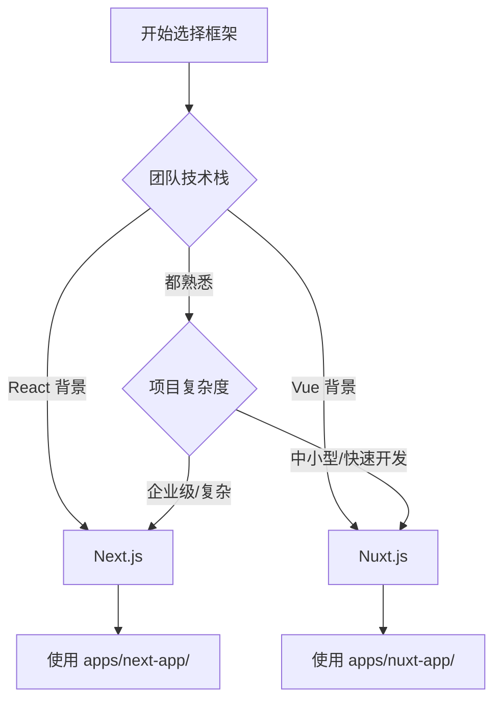

# 开发最佳实践

本指南将帮助您以最佳方式使用 TinyShip SaaS 模板，确保您的项目能够顺利开发、维护和升级。

## 📑 目录

- [1. 选择合适的框架](#1-选择合适的框架)
  - [Next.js 应用 (`apps/next-app/`)](#nextjs-应用-appsnext-app)
  - [Nuxt.js 应用 (`apps/nuxt-app/`)](#nuxtjs-应用-appsnuxt-app)
  - [推荐选择策略](#推荐选择策略)
- [2. 分支管理策略](#2-分支管理策略)
  - [推荐的 Git 工作流](#推荐的-git-工作流)
  - [分支命名规范](#分支命名规范)
  - [提交信息规范](#提交信息规范)
- [3. 添加自定义功能](#3-添加自定义功能)
  - [3.1 创建新的 API 端点](#31-创建新的-api-端点)
- [4. 接受模板更新](#4-接受模板更新)
  - [4.1 定期同步上游更新](#41-定期同步上游更新)
  - [4.2 处理冲突](#42-处理冲突)
  - [4.3 合并更新到功能分支](#43-合并更新到功能分支)

## 1. 选择合适的框架

Tinyship 提供了两个前端框架选择，根据您的需求选择合适的框架：

### Next.js 应用 (`apps/next-app/`)

**适用场景：**
- ✅ 需要强大的 SEO 支持
- ✅ 复杂的服务端渲染需求
- ✅ 团队熟悉 React 生态
- ✅ 需要细粒度的性能优化
- ✅ 企业级应用开发

**特点：**
- 完整的 App Router 支持
- 内置图像优化和字体优化
- 强大的中间件系统
- 丰富的部署选项

### Nuxt.js 应用 (`apps/nuxt-app/`)

**适用场景：**
- ✅ 快速开发和原型制作
- ✅ 团队熟悉 Vue 生态
- ✅ 需要开箱即用的功能
- ✅ 中小型项目
- ✅ 注重开发体验

**特点：**
- 零配置开发体验
- 自动导入组件和组合式函数
- 内置状态管理
- 简洁的目录结构

### 推荐选择策略



## 2. 分支管理策略

### 推荐的 Git 工作流

```bash
# 1. Fork 或 Clone 模板
git clone https://github.com/TinyshipCN/tinyship.git your-project-name
cd your-project-name

# 2. 设置上游仓库（用于接收模板更新）
git remote add upstream https://github.com/TinyshipCN/tinyship.git

# 3. 创建您的开发分支
git checkout -b feature/your-feature-name
```

### 分支命名规范

| 分支类型 | 命名格式 | 示例 |
|----------|----------|------|
| 功能开发 | `feature/功能名称` | `feature/user-profile` |
| 问题修复 | `fix/问题描述` | `fix/payment-validation` |
| 文档更新 | `docs/文档类型` | `docs/api-guide` |
| 性能优化 | `perf/优化内容` | `perf/database-queries` |
| 重构代码 | `refactor/重构模块` | `refactor/auth-middleware` |

### 提交信息规范

```bash
# 使用语义化提交信息
feat: add user subscription management
fix: resolve payment webhook timeout issue
docs: update authentication setup guide
perf: optimize database connection pooling
refactor: restructure email templates
```

## 3. 添加自定义功能

### 3.1 创建新的 API 端点

**❌ 避免修改现有接口：**
```typescript
// 不要修改 apps/next-app/app/api/users/route.ts
export async function GET() {
  // 修改现有逻辑可能导致冲突
}
```

**✅ 创建新的端点：**
```typescript
// 创建 apps/next-app/app/api/users/profile/route.ts
export async function GET() {
  // 您的自定义逻辑
}

// 创建 apps/next-app/app/api/custom/analytics/route.ts
export async function POST() {
  // 您的分析功能
}
```

## 4. 接受模板更新

### 4.1 定期同步上游更新

```bash
# 1. 切换到主分支
git checkout main

# 2. 获取上游更新
git fetch upstream

# 3. 合并上游更新
git merge upstream/main

# 4. 推送到您的远程仓库
git push origin main
```

### 4.2 处理冲突

当您的自定义代码与模板更新发生冲突时：

```bash
# 1. 查看冲突文件
git status

# 2. 手动解决冲突
# 编辑冲突文件，保留您的自定义逻辑

# 3. 标记冲突已解决
git add <解决冲突的文件>

# 4. 完成合并
git commit -m "resolve merge conflicts with upstream updates"
```

### 4.3 合并更新到功能分支

```bash
# 切换到您的功能分支
git checkout feature/your-feature-name

# 合并最新的主分支
git merge main

# 解决可能的冲突并测试
npm run dev
```


**记住：始终保持您的自定义代码与模板核心功能分离，这样您就能轻松获得模板的持续更新和改进！** 